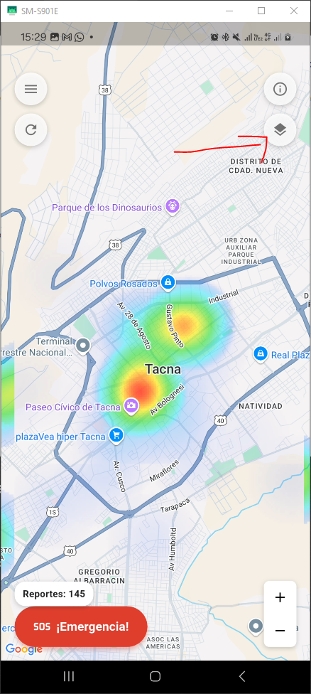
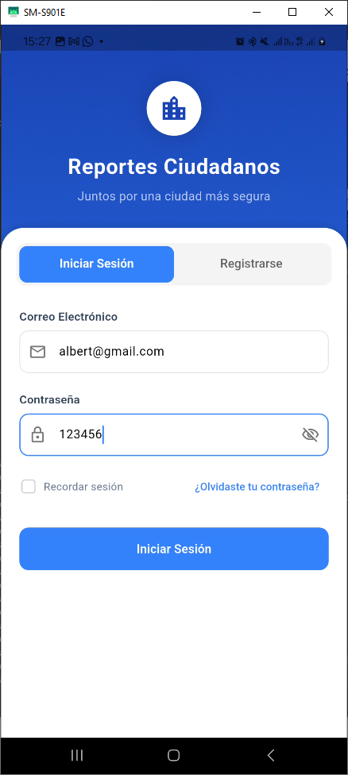
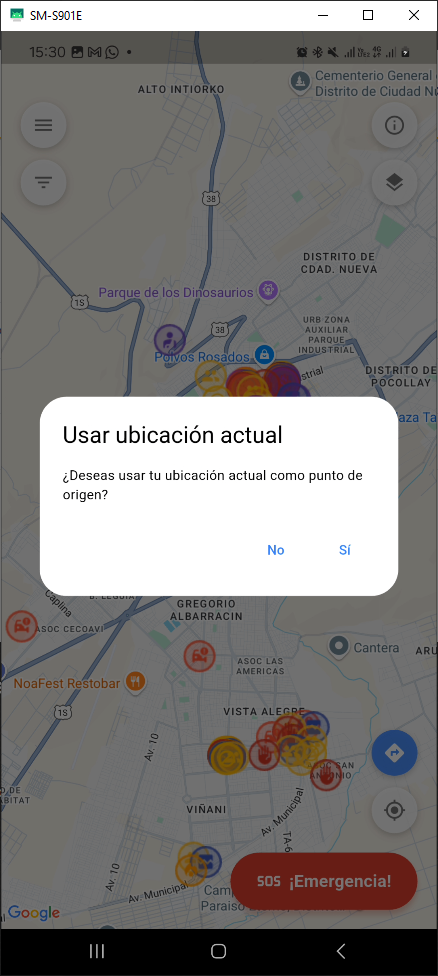
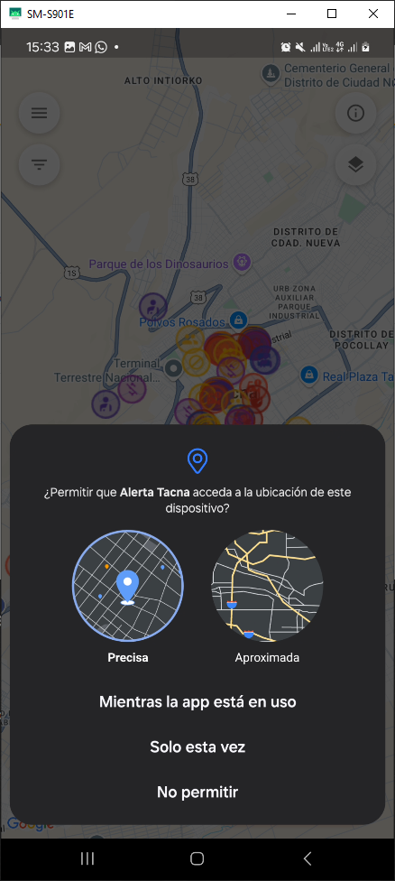
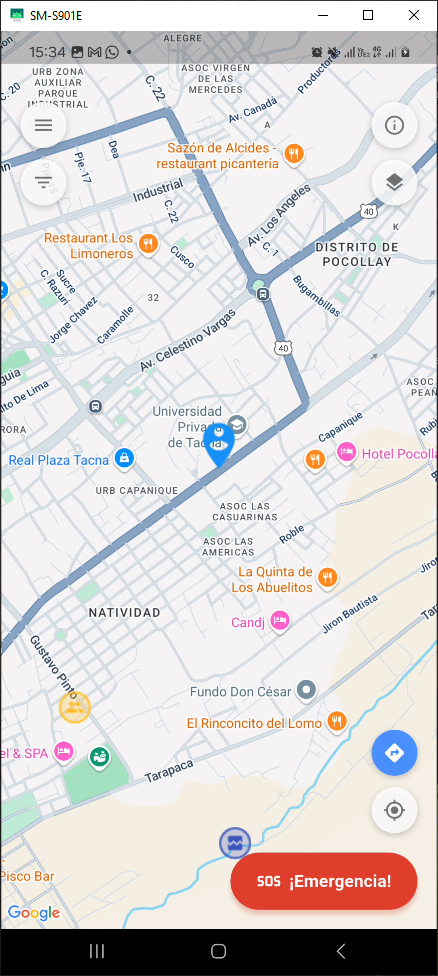
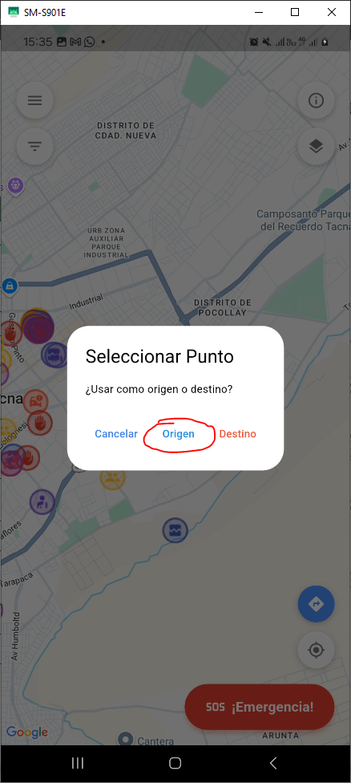
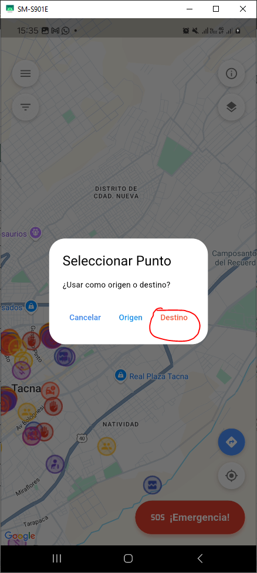
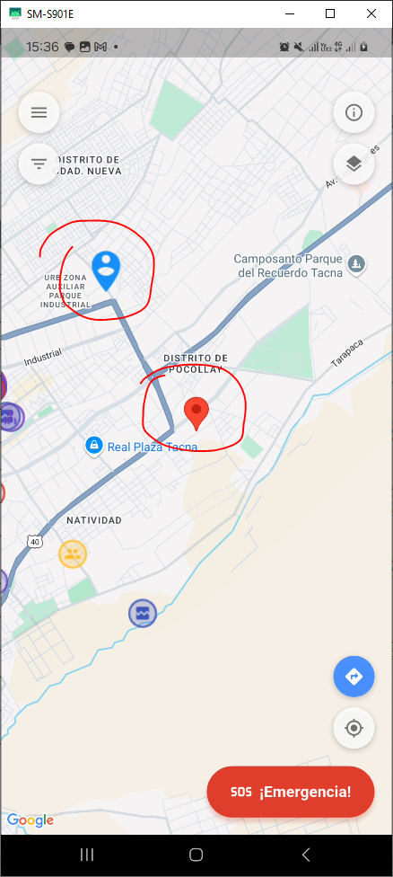
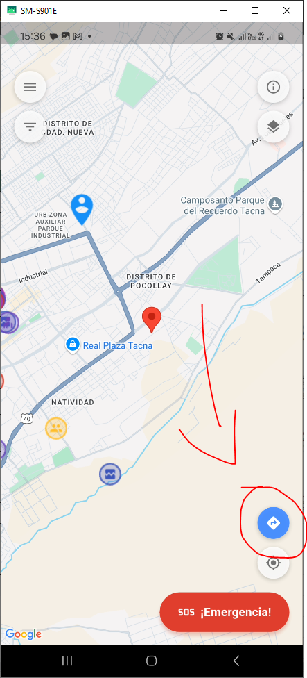

# SM2_EXAMEN_PRACTICO

## 📝 Descripción del Proyecto

Este proyecto fue desarrollado como parte del examen práctico de la Unidad II. Se implementaron las siguientes dos historias de usuario del Product Backlog:

- **H04**: Ver detalles de riesgo al tocar una zona del mapa.
- **H06**: Ingresar origen y destino, calcular ruta priorizando seguridad y mostrarla visualmente en el mapa.

## 🖼️ Capturas de Funcionalidades

### 📍 H04: Ver detalles de riesgo

---

### 🚗 H06: Calcular y mostrar ruta segura

| Paso | Imagen |
|------|--------|
| Login |  |
| Solicitud de ubicación |  |
| Permitir ubicación |  |
| Sitio actual marcado |  |
| Ingresar Origen |  |
| Ingresar Destino |  |
| Vista con origen y destino |  |
| Ruta calculada y mostrada |  |

---

## 🧰 Tecnologías y APIs Utilizadas

- **Flutter**
- **Firebase** (para autenticación y backend)
- **Google Maps API** (visualización del mapa)
- **Google Maps Routes API** (cálculo de rutas seguras)
- **Google Places API** (sugerencias de lugares al escribir)

---

## 🔁 Diagrama Mermaid de Funcionalidad

graph TD
    A[Usuario abre la app] --> B[Login con Firebase]
    B --> C[Permitir ubicación]
    C --> D[Mostrar mapa con zona actual]
    D --> E[Seleccionar zona -> Mostrar riesgos]:::riesgo
    D --> F[Ingresar origen y destino]:::ruta
    F --> G[Calcular ruta segura]
    G --> H[Mostrar ruta segura en mapa]

## 👤 Autor

**Albert Kenyi Apaza Ccalle**
Código: **2021071075**

## 🔗 Repositorio GitHub

[https://github.com/AlbertApaza/SM2\_EXAMEN\_PRACTICO](https://github.com/AlbertApaza/SM2_EXAMEN_PRACTICO)

