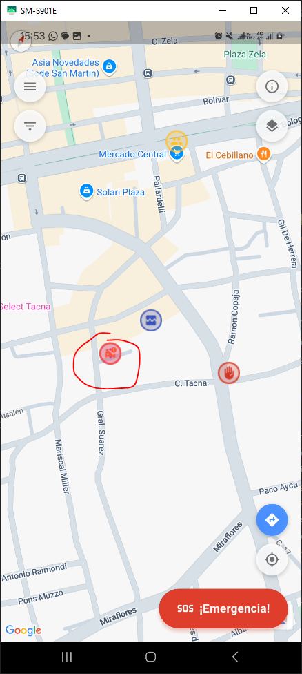
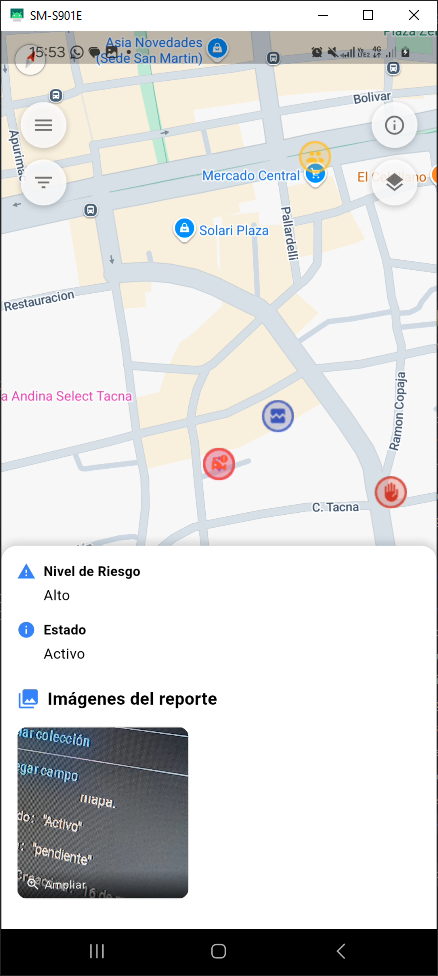
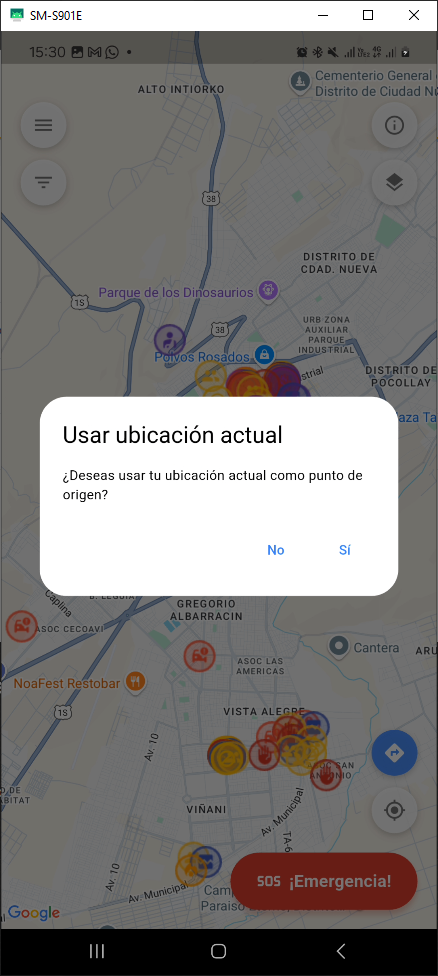
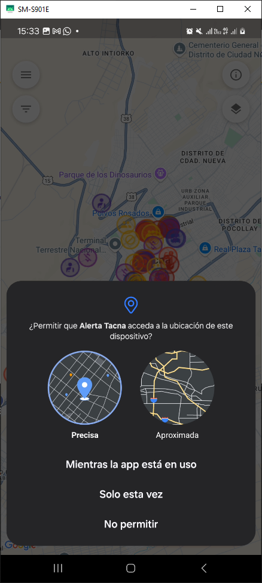
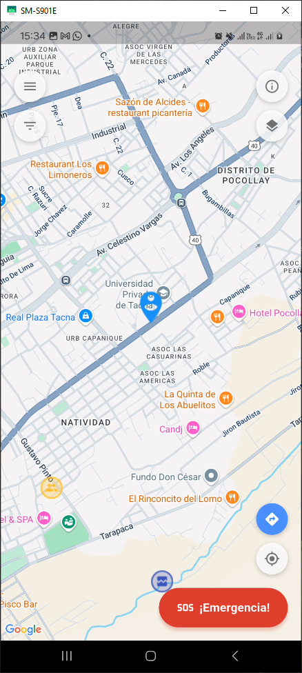
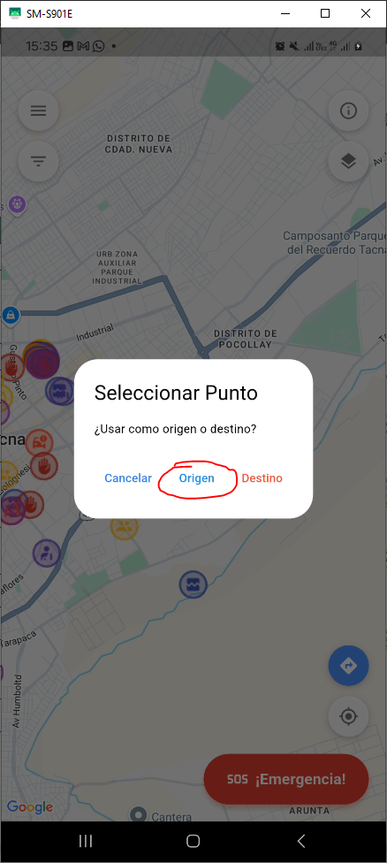
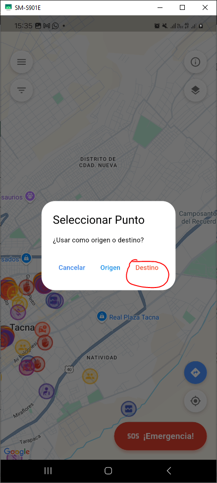
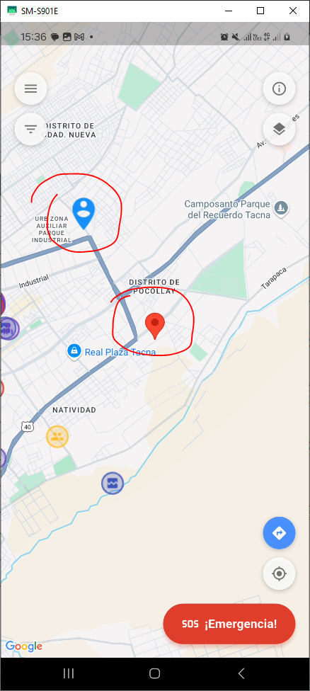
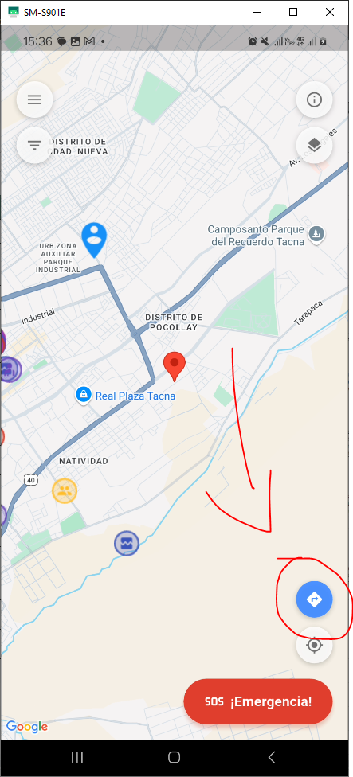

# 📘 Examen Práctico - Unidad II  
### ALBERT KENYI APAZA CCALLE  
**Código:** 2021071075  

---

## 🔖 Historias de Usuario Implementadas

| Código | Descripción |
|--------|-------------|
| **H04** | Permitir ver detalles de riesgo al tocar una zona del mapa. |
| **H06** | Permitir al usuario ingresar origen y destino, calcular ruta priorizando seguridad y mostrarla visualmente en el mapa. |

---

## 📱 Capturas de Funcionalidad

### 🔹 H04 - Ver detalles de riesgo al tocar una zona del mapa

| Paso | Descripción | Imagen |
|------|-------------|--------|
| 1 | Login con Firebase |  |
| 2 | Seleccionar Marcadores con peligros Reportados |  |
| 2 | Visualizar informacion de los peligros y hasta imagenes |  |

---

### 🔹 H06 - Ruta segura: origen, destino y visualización

| Paso | Descripción | Imagen |
|------|-------------|--------|
| 1 | Solicitud de permiso de ubicación |  |
| 2 | Solicitud del sistema para acceder a la ubicación |  |
| 3 | Ubicación actual mostrada en el mapa |  |
| 4 | Ingresar punto de origen |  |
| 5 | Ingresar punto de destino |  |
| 6 | Visualización de ambos puntos |  |
| 7 | Ruta segura trazada en el mapa |  |

---

## 🧰 Tecnologías y APIs Utilizadas

- **Flutter** (Desarrollo multiplataforma)
- **Firebase** (Autenticación y backend)
- **Google Maps API** (Visualización de mapas)
- **Google Maps Routes API** (Trazado de rutas seguras)
- **Google Places API** (Búsqueda y autocompletado de lugares)

---

## 📌 Diagrama de Flujo (Mermaid)

graph TD
    A[Inicio] --> B[Login con Firebase]
    B --> C[Solicitar ubicación al usuario]
    C --> D[Mostrar mapa con ubicación actual]
    D --> E[Seleccionar zona de riesgo]:::riesgo
    E --> F[Mostrar detalles del riesgo]
    D --> G[Ingresar origen y destino]:::ruta
    G --> H[Calcular ruta segura]
    H --> I[Mostrar ruta segura en el mapa]
