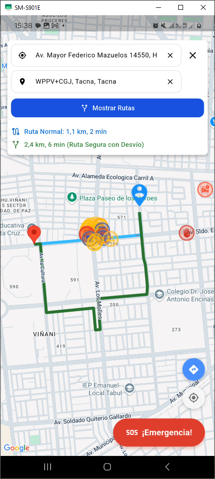

# 📘 Examen Práctico - Unidad II  
### ALBERT KENYI APAZA CCALLE  
**Código:** 2021071075  

---

## 🔖 Historias de Usuario Implementadas

| Código | Descripción |
|--------|-------------|
| **H04** | Permitir ver detalles de riesgo al tocar una zona del mapa. |
| **H06** | Permitir al usuario ingresar origen y destino, calcular ruta priorizando seguridad y mostrarla visualmente en el mapa. |

---

## 📱 Capturas de Funcionalidad

### 🔹 H04 - Ver detalles de riesgo al tocar una zona del mapa

| Paso | Descripción | Imagen |
|------|-------------|--------|
| 1 | Login con Firebase |  |
| 2 | Alternar a mapa de Reportes y Rutas |  |
| 3 | Seleccionar Marcadores con peligros reportados |  |
| 4 | Visualizar información de los peligros y hasta imágenes |  |

---

### 🔹 H06 - Ruta segura: origen, destino y visualización

| Paso | Descripción | Imagen |
|------|-------------|--------|
| 1 | Solicitud de permiso de ubicación |  |
| 2 | Solicitud del sistema para acceder a la ubicación |  |
| 3 | Ubicación actual mostrada en el mapa |  |
| 4 | Ingresar punto de origen |  |
| 5 | Ingresar punto de destino |  |
| 6 | Visualización de ambos puntos |  |
| 7 | Ruta segura trazada en el mapa (paso 1) |  |
| 8 | Ruta segura trazada en el mapa (paso 2) |  |

---

## 🧰 Tecnologías y APIs Utilizadas

- **Flutter** (Desarrollo multiplataforma)
- **Firebase** (Autenticación y backend)
- **Google Maps API** (Visualización de mapas)
- **Google Maps Routes API** (Trazado de rutas seguras)
- **Google Places API** (Búsqueda y autocompletado de lugares)

---

## 🛠️ Entorno Flutter y Dependencias Usadas

Archivo `pubspec.yaml`:

name: proyectomovilesii
description: "A new Flutter project."
publish_to: 'none'
version: 0.1.0

environment:
  sdk: ^3.5.3

dependencies:
  flutter:
    sdk: flutter
  cloud_firestore: ^5.6.6
  firebase_core: ^3.13.0
  url_launcher: ^6.3.1
  google_maps_flutter: ^2.12.1
  image_picker: ^1.1.2
  firebase_storage: ^12.4.5
  geolocator: ^14.0.0
  intl: ^0.20.2
  uuid: ^4.5.1
  permission_handler: ^12.0.0+1
  google_maps_webservice: ^0.0.18
  flutter_polyline_points: ^1.0.0
  geocoding: ^2.0.5
  flutter_map: ^4.0.0
  flutter_map_heatmap: ^0.0.5
  latlong2: ^0.8.2
  shared_preferences: ^2.5.3

dev_dependencies:
  flutter_test:
    sdk: flutter
  flutter_lints: ^4.0.0

flutter:
  uses-material-design: true

---

## 🗂️ Código Fuente Relevante

El código base fue tomado del repositorio:

🔗 [https://github.com/Teamggez/moviles2Proyecto](https://github.com/Teamggez/moviles2Proyecto)

Las funcionalidades de las historias de usuario **H04** y **H06** están implementadas principalmente en el archivo:

📄 `lib/screens/screenRutaSegura.dart`

---

## 🚀 Release Oficial del Proyecto

🔖 Versión estable 1.0.0V publicada en GitHub:

👉 [https://github.com/AlbertApaza/SM2\_EXAMEN\_PRACTICO/releases/tag/1.0.0V](https://github.com/AlbertApaza/SM2_EXAMEN_PRACTICO/releases/tag/1.0.0V)

---

---

## 🔗 Repositorio GitHub del Proyecto

👉 [https://github.com/AlbertApaza/SM2\_EXAMEN\_PRACTICO](https://github.com/AlbertApaza/SM2_EXAMEN_PRACTICO)

